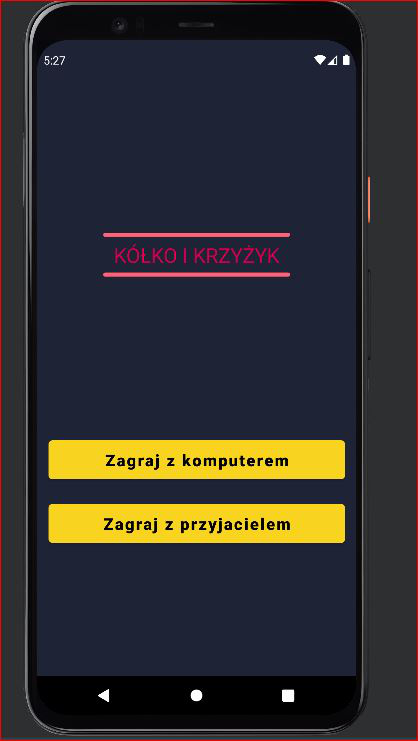
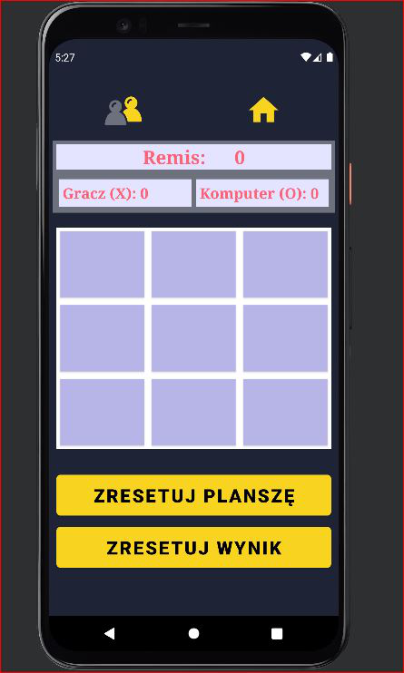

#Tic Tac Toe

<h1>Project - game TicTacToe</h1>

https://github.com/MariiaS3/Game_TicTacToe-android/assets/72567148/36dde20e-28f7-4f4c-be08-3e0233dd080e

<h2>TODO:</h2>
<ul>
  <li>
   The user should see the board, clicking on it puts a circle or cross on it.
  </li>
  <li>
    The application itself should detect when a win occurs.
  </li>
  <li>
   Two independent players making alternating moves.
  </li>
  <li>
    The user can choose two modes: play in pairs or solo.
  </li>
</ul>

